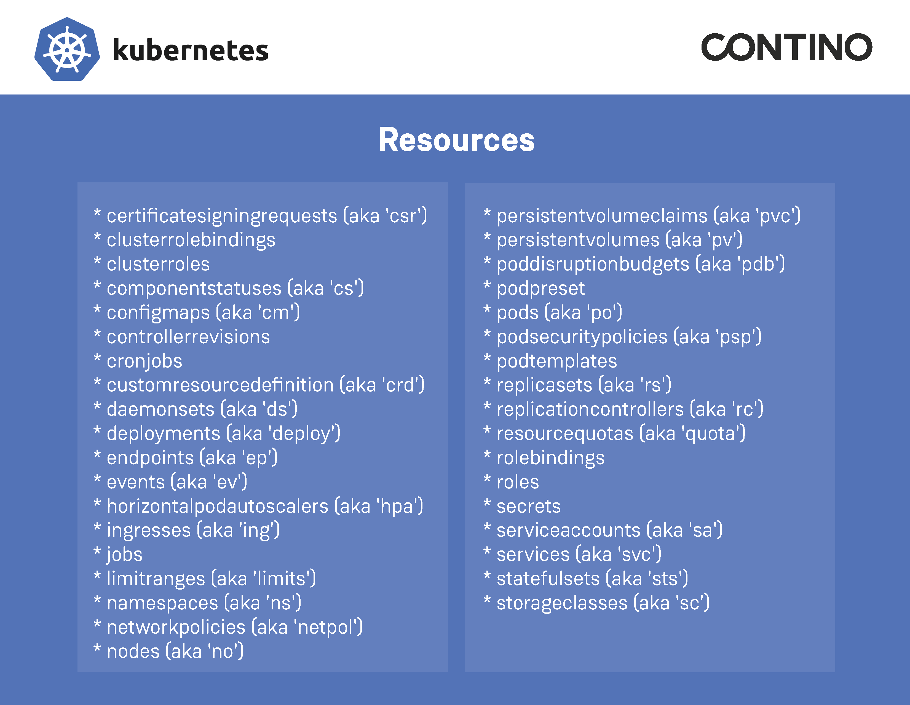

# Kubernetes Kubectl Cheat Sheet

[Kubernetes Kubectl Cheat Sheet PDF version](https://github.com/contino/kubernetes-command-cheat-sheet/raw/master/resources/kubernetes_cheatsheet.pdf)

# Other Kubernetes resources

[Contino Blog](https://www.contino.io/insights/topic/kubernetes)

[kubernetes.io kubectl cheat sheet](https://kubernetes.io/docs/reference/kubectl/cheatsheet/)

[Contino learning on Katacode](https://katacoda.com/contino/courses/kubernetes)

[Intro to K8](https://contino.github.io/intro-k8/)

[![CC BY 4.0][cc-by-shield]][cc-by]

This work is licensed under a [Creative Commons Attribution 4.0 International
License][cc-by].

[cc-by]: http://creativecommons.org/licenses/by/4.0/
[cc-by-image]: https://i.creativecommons.org/l/by/4.0/88x31.png
[cc-by-shield]: https://img.shields.io/badge/License-CC%20BY%204.0-lightgrey.svg

